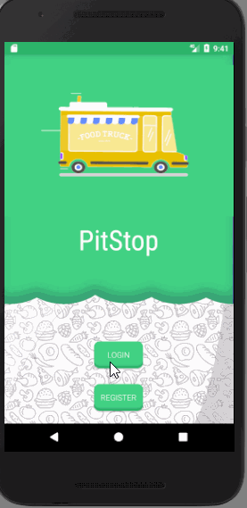

# Pitstop_HackGT2017

<u>Description</u>

A mobile food ordering application for food trucks that allows users to see which food trucks are have arrived on campus and order from them.
The user is presented with a code that they show to the food truck to recieve their food.

